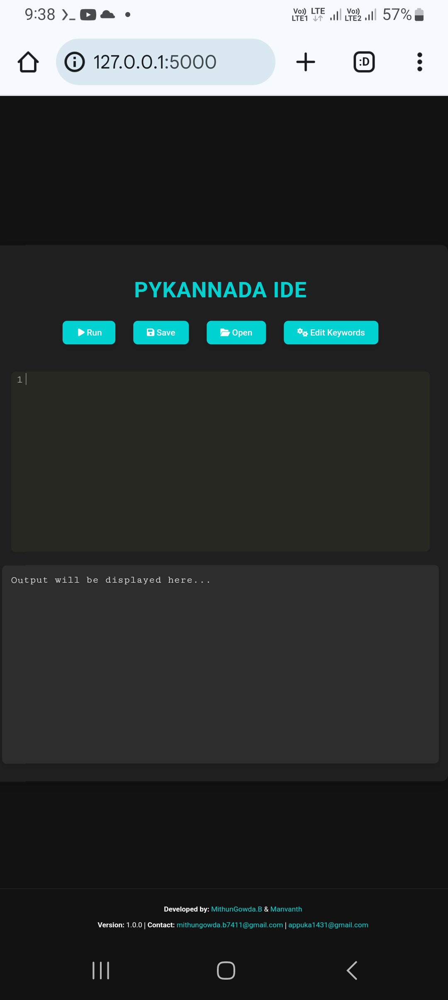
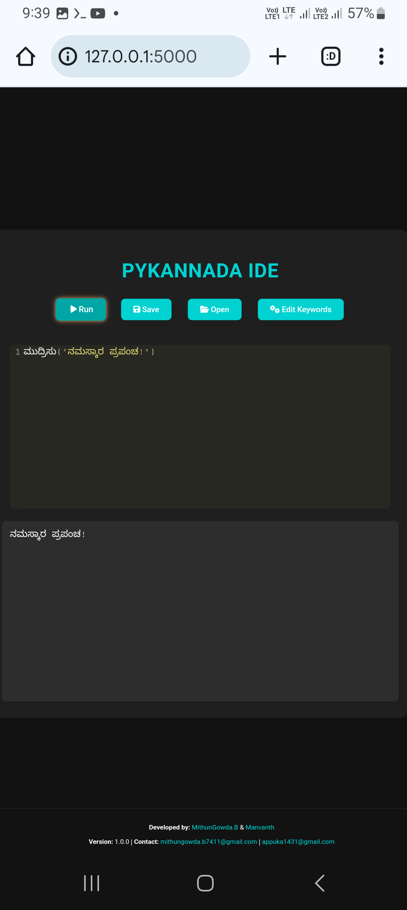
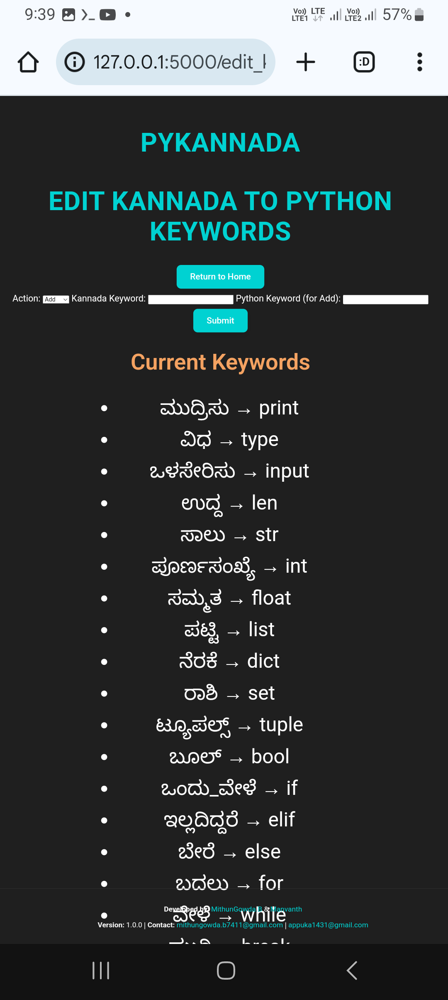
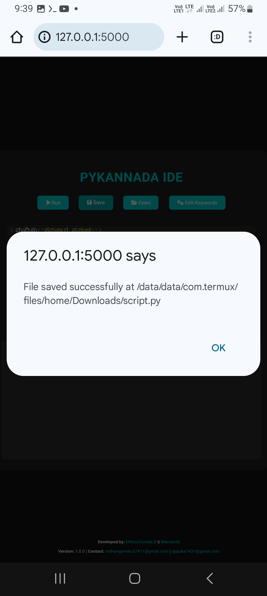

# **pyKannada_IDE** 
- A Unique IDE for Kannada Programmers!  
> **Code in Kannada, Execute in Python!**  

---

## 🎉 **What is pyKannada_IDE?**

**pyKannada_IDE** is an innovative **IDE** that allows you to write **Python code** in **Kannada**! It's designed to make programming in Kannada accessible to everyone, especially for those who prefer working with their native language.

Whether you're a beginner, a student, or someone who loves experimenting with language and code, **pyKannada_IDE** brings you the power to write Python code in Kannada, which is then translated into Python and executed seamlessly.

---

## 🌟 **Why Choose pyKannada_IDE?**

- **Native Language Programming**: Write code in **Kannada**, and let the IDE handle the translation to Python.
- **Instant Code Execution**: Execute your Kannada code in real-time and get immediate feedback on your screen.
- **Custom Keyword Mapping**: Edit Kannada-to-Python keyword mappings for your preferences.
- **Save Your Work**: Easily save Kannada and Python code to access later.
- **Automatic Port Management**: The app automatically selects an available port, so you don’t have to worry about configuration.

---

## 🖼️ **Screenshots of pyKannada_IDE**

### **1. Home Page - Enter Your Kannada Code**  
This is where you start by typing your code in **Kannada**. It’s as simple as it gets!

  
> **Input** your Kannada code and execute it directly from the same page.

---

### **2. Execution Results - See It in Action!**  
Once you hit **Run**, the code is translated into Python and executed instantly, giving you real-time output.

  
> **Real-time results**: Your Kannada code is translated and executed seamlessly, making programming fun and interactive.

---

### **3. Edit Keywords - Customize Kannada-to-Python Mappings**  
Want to add or modify the mapping? Use this page to do so!

  
> **Customize** your Kannada-to-Python keyword mappings to match your style.

---

### **4. Save Your Code - Keep Your Progress Safe**  
You can now **save** your Kannada code or its Python equivalent with just a click.

  
> **Save your work**: Keep your code backed up for future reference.

---

## 🔧 **How to Use pyKannada_IDE?**

### **1. Install pyKannada_IDE**

You can install **pyKannada_IDE** both from **PyPI** or from **GitHub**.

---

### **Installation from PyPI**:

To install **pyKannada_IDE** from **PyPI**, simply use the following command in your terminal or command prompt:

```bash
pip install pyKannada_IDE
```

After installation, you can run the IDE by typing the following command:

```bash
pyKannada_IDE
```
or

```bash
python -m pyKannada_IDE
```

---

### **Installation from GitHub**:

If you want the latest development version or plan to contribute, you can clone the repository from **GitHub**.

#### Steps:

1. Clone the repository:

```bash
git clone https://github.com/mithun50/pyKannada_IDE.git
```

2. Navigate into the project directory:

```bash
cd pyKannada_IDE
```

3. Install dependencies:

```bash
pip install -r requirements.txt
```

4. Run the IDE:

```bash
python app.py
```

---

## 🌱 **Features of pyKannada_IDE**

### **Write in Kannada**

Just like you write in English, you can now write in Kannada for **Python programming**. For example, to print a message:

```kannada
ಮುದ್ರಿಸು("ನಮಸ್ಕಾರ ಪ್ರಪಂಚ!")
```

It will be translated into:

```python
print("ನಮಸ್ಕಾರ ಪ್ರಪಂಚ!")
```

---

### **Code Execution**

Once your Kannada code is ready, click **Run** and instantly see the Python execution result below the editor. No need to translate it manually!

---

### **Custom Keyword Mapping**

You can modify the Kannada-to-Python mappings. For example, if you want to change how a keyword is mapped, simply go to the **Edit Keywords** page, and you can:

- **Add new keywords**: Add a new Kannada word and define its Python equivalent.
- **Delete old keywords**: Remove any keywords you no longer need.

---

## 🛠️ **How to Contribute to pyKannada_IDE**

We’re open to contributions! If you have any IDEas or would like to improve **pyKannada_IDE**, you can:

1. **Fork the repository**.
2. **Create a new branch** for your changes.
3. **Add your changes** and test them locally.
4. **Submit a pull request**.

We appreciate all contributions!

---

## 📲 **Follow Us on Social Media**

For the latest updates, tips, and more, don’t forget to follow us on Instagram:

- **Mithun Gowda B**: [@mithun_gowda](https://instagram.com/mithun_gowda)
- **Manvanth**: [@manvanth_dev](https://instagram.com/manvanth_dev)

Stay connected, stay updated!

---

## ⚠️ **Known Limitations**

- **Input-based Programs**: **`input()`** based Python functions are **not supported** in the current version. We’re actively working to add support for this feature.
  
**pyKannada_IDE** is intended for **educational purposes** and may not be suited for production-level projects.

---

## 🔑 **License**

**pyKannada_IDE** is released under the [MIT License](LICENSE).  

---

## 🏆 **Conclusion**

If you’re passionate about Python programming and want to make coding in Kannada an exciting experience, **pyKannada_IDE** is for you! Whether you're learning to code or you're a seasoned programmer, we hope this tool brings you new opportunities to learn, experiment, and enjoy coding.

---

